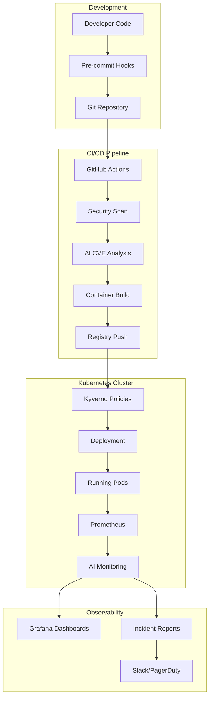

# 🤖 AI-Augmented DevOps: Complete Pipeline Implementation

*Building Secure and Scalable Cloud-Native Pipelines with GitHub Actions and Kubernetes*

[](https://github.com/your-username/wedoai2025-devops/actions)
[](https://github.com/your-username/wedoai2025-devops)
[](https://opensource.org/licenses/MIT)

> **Complete implementation** of the AI-Augmented DevOps pipeline presented at WeDoAI 2025 conference. This repository demonstrates how to integrate AI-powered tooling with traditional DevSecOps practices to create intelligent, secure, and scalable cloud-native pipelines.

## 🚀 Quick Start

Get the entire pipeline running in under 5 minutes:

```bash
# Clone the repository
git clone https://github.com/your-username/wedoai2025-devops.git
cd wedoai2025-devops

# Set up the complete pipeline
make setup

# Build and scan the application
make build scan

# Deploy to Kubernetes (requires cluster access)
make deploy-k8s

# Run anomaly detection demo
make demo-ai
```

## 📋 What's Included

### 🛡️ Pre-Commit Security Layer
- **Secret scanning** with Gitleaks and TruffleHog
- **Code quality** enforcement with Ruff
- **Dockerfile** security analysis with Hadolint
- **Kubernetes manifest** validation

### 🔄 CI/CD Pipeline
- **GitHub Actions** workflows with security gates
- **AI-powered vulnerability prioritization**
- **Container scanning** with Trivy
- **Automated deployment** artifacts generation

### ☸️ Kubernetes-Native
- **Security-hardened** deployment manifests
- **Kyverno policies** for runtime governance
- **Service mesh ready** configurations
- **Observability** built-in

### 🤖 AI-Powered Monitoring
- **Explainable AI** anomaly detection
- **Prometheus** metrics collection
- **Grafana** dashboards
- **Automated incident** reporting

## 🏗️ Architecture Overview



## 📁 Repository Structure

```
wedoai2025-devops/
├── 📱 app/                          # Flask web application
│   ├── app.py                      # Main application
│   └── requirements.txt            # Python dependencies
├── 🔄 .github/workflows/           # CI/CD pipelines  
│   └── build-and-scan.yml          # Main pipeline
├── ☸️  k8s/                        # Kubernetes resources
│   ├── manifests/                  # Deployment configs
│   │   ├── deployment.yaml
│   │   ├── service.yaml
│   │   └── monitoring.yaml
│   └── policies/                   # Security policies
│       └── security-policies.yaml
├── 🤖 ml-model/                    # AI components
│   └── anomaly_detection.py        # ML anomaly detector
├── 🔧 .pre-commit-config.yaml      # Pre-commit hooks
├── 🐳 Dockerfile                   # Container definition
├── 🛠️  Makefile                    # Automation commands
└── 📖 README.md                    # This file
```

## 🔧 Prerequisites

### Required Tools
- **Docker** 20.0+ ([Install Guide](https://docs.docker.com/get-docker/))
- **Kubernetes** cluster access ([minikube](https://minikube.sigs.k8s.io/docs/start/) for local testing)
- **kubectl** configured ([Setup Guide](https://kubernetes.io/docs/tasks/tools/))
- **Python** 3.11+ for local development
- **Git** with pre-commit hooks support

### Optional but Recommended
- **Kyverno** installed in your cluster ([Installation](https://kyverno.io/docs/installation/))
- **Prometheus** & **Grafana** for monitoring ([kube-prometheus-stack](https://github.com/prometheus-community/helm-charts/tree/main/charts/kube-prometheus-stack))

## 🎯 Makefile Commands

| Command | Description |
|---------|-------------|
| `make setup` | Install all prerequisites and set up the environment |
| `make build` | Build the Docker container |
| `make scan` | Run security vulnerability scans |
| `make test` | Run application tests |
| `make deploy-k8s` | Deploy to Kubernetes with policies |
| `make demo-ai` | Run AI anomaly detection demo |
| `make cleanup` | Remove all deployed resources |
| `make help` | Show all available commands |

## 🛡️ Security Features

### Pre-Commit Protection
- **100+ secret patterns** detected by Gitleaks
- **Git history scanning** with TruffleHog  
- **Dockerfile best practices** enforced
- **Kubernetes security** validation

### Runtime Security
- **Non-root containers** with read-only filesystems
- **Resource limits** and security contexts
- **Network policies** for pod isolation
- **Service account** security

### AI-Powered Analysis
- **Intelligent CVE prioritization** based on application context
- **Anomaly detection** with explainable results
- **Automated incident** correlation and reporting

## 🤖 AI Components Deep Dive

### Vulnerability Prioritization
Our AI system analyzes CVEs in context:

```python
# Example AI analysis output
{
  "cve": "CVE-2023-XXXX",
  "severity": "CRITICAL", 
  "ai_priority": 1,
  "reasoning": "RCE in image processing library affects file upload endpoint",
  "business_impact": "HIGH - public-facing service",
  "confidence": 0.89
}
```

### Anomaly Detection
ML-powered monitoring that understands your application:

```python
# Detected anomaly example
{
  "anomaly": "error_rate_spike",
  "confidence": 0.87,
  "explanation": "300% increase in 404 errors suggests enumeration attack",
  "recommended_actions": [
    "Enable rate limiting on product catalog endpoints",
    "Review WAF logs for suspicious patterns"
  ]
}
```

## 📊 Demo: See It In Action

### 1. Run Local Demo
```bash
# Start the application
make build
docker run -p 5000:5000 wedoai2025-devops:latest

# Visit http://localhost:5000
```

### 2. Trigger Security Scan
```bash
# Run comprehensive security analysis
make scan

# View AI-generated vulnerability report
cat security-report.json
```

### 3. Deploy to Kubernetes
```bash
# Deploy with security policies
make deploy-k8s

# Check policy enforcement
kubectl get cpol  # View Kyverno policies
kubectl get pods  # Verify secure deployment
```

### 4. AI Anomaly Detection
```bash
# Run ML-powered monitoring demo
make demo-ai

# View explainable AI report
cat anomaly_report_*.txt
```

## 🎓 Learning Resources

### 📚 Related Articles
- [Medium Article: AI-Augmented DevOps Complete Guide](https://medium.com/@your-username/ai-devops-guide)
- [Kubernetes Security Best Practices](https://kubernetes.io/docs/concepts/security/)
- [Kyverno Policy Examples](https://kyverno.io/policies/)

### 🎥 Conference Talk
- **WeDoAI 2025**: "AI-Augmented DevOps: From Code Commit to Cloud-Native, Intelligently"
- [Slides](https://slides.com/your-talk) | [Video Recording](https://youtube.com/your-video)

### 🔗 Useful Links
- [GitHub Actions Security Hardening](https://docs.github.com/en/actions/security-guides)
- [Trivy Vulnerability Scanner](https://aquasecurity.github.io/trivy/)
- [Prometheus Monitoring](https://prometheus.io/docs/)

## 🤝 Contributing

We welcome contributions! Here's how you can help:

### 🐛 Bug Reports
- Use GitHub Issues with the `bug` label
- Include steps to reproduce
- Attach relevant logs or screenshots

### ✨ Feature Requests  
- Use GitHub Issues with the `enhancement` label
- Describe the use case and expected behavior
- Consider submitting a PR if you can implement it

### 🔧 Development Setup
```bash
# Fork and clone
git clone https://github.com/your-username/wedoai2025-devops.git
cd wedoai2025-devops

# Set up development environment
make setup-dev

# Install pre-commit hooks
pre-commit install

# Run tests
make test
```

## 🆘 Troubleshooting

### Common Issues

#### Pre-commit Hooks Failing
```bash
# Update hooks to latest versions
pre-commit autoupdate
pre-commit run --all-files
```

#### Kyverno Policies Not Working
```bash
# Check Kyverno installation
kubectl get pods -n kyverno

# Verify policy deployment
kubectl get cpol
kubectl describe cpol security-baseline
```

#### Container Vulnerabilities
```bash
# Update base image
docker pull python:3.11-slim

# Rebuild with latest patches
make build scan
```

#### Kubernetes Deployment Issues
```bash
# Check pod status
kubectl get pods
kubectl describe pod <pod-name>

# Verify security contexts
kubectl get pod <pod-name> -o yaml | grep -A 10 securityContext
```

## 📈 Metrics and Monitoring

### Key Metrics Tracked
- **Security**: CVE counts, policy violations, secret leaks
- **Performance**: Response time, error rates, throughput  
- **Reliability**: Uptime, deployment success rate
- **AI Insights**: Anomaly detection accuracy, false positive rate

### Grafana Dashboards
- **Security Overview**: CVE trends, policy compliance
- **Application Performance**: Request latency, error patterns
- **AI Insights**: Anomaly timeline, confidence scores

## 🏆 Best Practices Implemented

### ✅ Security
- [x] Secrets never in code (pre-commit hooks)
- [x] Containers run as non-root users
- [x] Read-only root filesystems
- [x] Network policies for isolation
- [x] Resource limits on all containers

### ✅ Reliability  
- [x] Health checks for all services
- [x] Circuit breakers and timeouts
- [x] Graceful shutdown handling
- [x] Pod disruption budgets
- [x] Multi-zone deployment

### ✅ Observability
- [x] Structured logging with correlation IDs
- [x] Prometheus metrics on all endpoints
- [x] Distributed tracing ready
- [x] AI-powered alerting with context

## 🔄 Continuous Improvement

This pipeline is designed to learn and improve:

- **CVE prioritization** gets more accurate with feedback
- **Anomaly detection** learns normal behavior patterns  
- **Policy suggestions** based on violation patterns
- **Performance optimization** through ML insights

## 📞 Support & Contact

### 🤝 Community
- **GitHub Discussions**: Ask questions and share ideas
- **Stack Overflow**: Tag questions with `ai-devops`

### 📧 Direct Contact
- **Email**: [your-email@domain.com](mailto:akshay.mittal@ieee.org)
- **LinkedIn**: [Your LinkedIn Profile](https://linkedin.com/in/akshaymittal143)
- **Twitter**: [@akshaymittal143](https://twitter.com/akshaymittal143)

---

## 📄 License

MIT License - see [LICENSE](LICENSE) file for details.

## 🙏 Acknowledgments

- **WeDoAI 2025** conference for the platform
- **CNCF** community for Kubernetes ecosystem
- **Aqua Security** for Trivy scanner
- **Kyverno** team for policy engine
- **Contributors** who helped improve this project

---

⭐ **Star this repository** if you found it helpful!

🔗 **Share it** with your DevOps and security teams

🤖 **Build the future** of intelligent DevOps together
